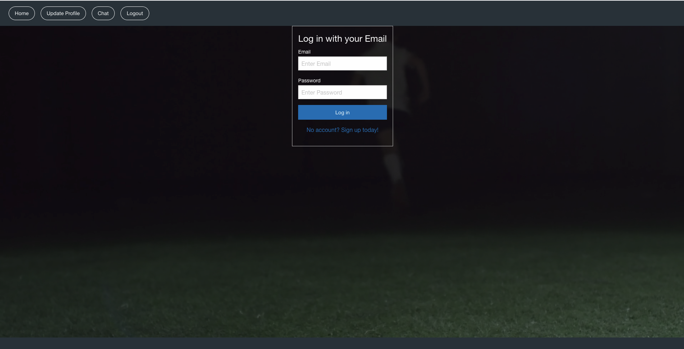
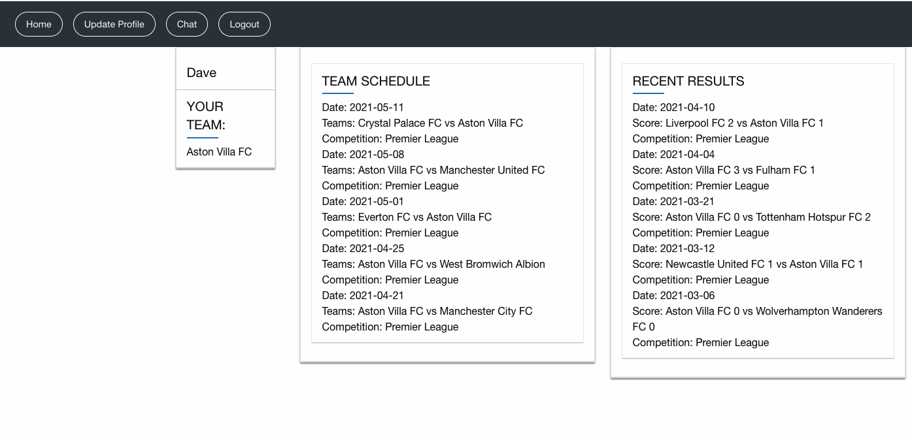
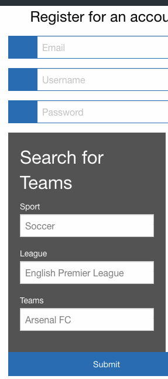
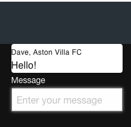

# Project Three: Just-Your-Teams...Strikes Back!
​
By expanding on our last project, Just Your Teams, we will ad an interface that builds on that premise and adds a layer of user interaction. Users will be able to chat with other fans who like similar teams.

# Just Your Teams

Pitch: 
The modern sports website is too convoluted and numerous. We are aiming to build a clean, preferences focus news resource for sports. The user will be prompted to pick a preference of leagues/teams upon initial log in and will only see news related to results, current matches, upcoming fixtures and press releases. This will make our website a personalized team feed as opposed to requiring a user to syphon through pages upon pages to find the news they are looking for. 
​
## Links

GitHub Repo: 

https://github.com/GeloneJT/react-just-your-teams

Heroku App:

https://rut-react-just-your-teams.herokuapp.com/

## Screenshots

## Schedule
​
- Apr. 6th
    * Make conceptual layout pages and chat room 
    * Make file structure  
    * Begin work on react app
        * All completed
- Apr. 7th
    * Begin importing previous project
    * Begin working on chat feature
    * Be able to launch and produce each individual page
    * Begin breaking down components
    * Begin routing
        * All completed
- Apr. 8th
    * Start and complete backend
        * Models
        * JYT DB routes
        * API routes
    * Begin working on login/logout
    * Start code for chat feature
    * Deploy to Heroku
        * All but Deploy to Heroku completed
- Apr. 9th
    * Need to understand routes better
    * Login still not working
    * API call on userPage working
    * Still haven't deployed to heroku because of these issues
        * Taking break over weekend to focus on HW completion
            * None completed for many reasons:
                * Routes are understood and completed but aren't being called in 2/3 pages where needed. Communication and reaching out for help must improve.
                * userPage API call was undone due to our API updating and call had to be written.
- Apr. 12th
    * Get caught up​
        * userPage API is completed 
        * Login and Create user functions are done 
        * Chatroom code has been pushed to main
            * James has been solely working on this the whole time
                * Almost completed -> routes need to be called in order for users to login and to create a new user

- Apr. 13
    * Reach MVP
    * Deploy to Heroku
    * Start styling

- Apr. 14th 
    * Finish chat room code
    * Start passport working
    * Break create account into components
    * Put third party API call on backend
        * All done 

- Apr. 15th
    * Style style style
    * Continue work on passport
        * We are now at a stand still until able to login and out
    
- Apr. 16th/17th
    * Finish passport
    * Begin integrating chatroom
    * Fix createaccount link -> login may fix this?
    * Begin work on presentation
    * Style some more!
    * Need to breakdown team-search and have put route update AboutMe section in userpage
    * Userpage needs to link to chat
    * Userpage needs to pass props to AboutMe
    * Need to assign number value to team
    * Connect User to Message model?

- Apr 18th
    * Redirect on CreateAccount ***DONE***
        * See LoginForm ***DONE***
    * Toggle Logout Button **Done**
    * Place localstorage variables in userpage **Done**
    * Assign numbers to teams on signup for API search **Done**
    * Style Style style!!!
    * Put route for aboutme!
    * Integrate ChatRoom

** FOR JAMES AND DAVE -> .config in chatmessage, app.css in chatmessage, socket.io(http) in server.js

** Passport notes -> our getUsers route is a get...needs to be a post
    * Check with Jelani if he has made a route is trying to use an existing route
    * Need API call on all pages to ensure we can find out if user is loggedin 

require: passport express-session mongoose
app.use(session({session info here}))
app.use(passport.initialize());
app.use(passport.session());
## Requirements Check List
-   Must use RectJS
    * Will add a user interaction portion of site
    * Users will be able to interact with fans teams they like
-   Must use Node or Express Web Server
    * Express will be used
-   Must have a MySQL/MongoDb database w/ Sequelize or Mongoose ORM
    * MySql and Sequelize will be used
-   Must have both GET and POST routes
    * Get route for previous chat messages
    * Post route to post messages
-   Must utilize at least two libraries, packages, or technologies that we haven't discussed
    * Will use Foundation
    * Will use Socketio
-   Must allow for or involve the authentication of users in some way
    * Already using bcrypt and will add passport
-   Must have a polished frontend/UI
-   Must have a folder structure that meets MVC Paradigm
-   Must meet good quality coding standards
-   Must not expose sensitive API key information on the server Pitch
​
## Confirmed Resources
[SportsRadar API](https://www.sportradar.com/media/data-feeds-and-services/sports-api/)
 
 
[Foundation Framework](https://get.foundation/)
​
​
## Possible Resources
​
[Converting Project to React](https://javascript.plainenglish.io/how-to-convert-any-web-page-to-reactjs-9740f1ba15db)
 
 
[React Foundation](https://www.npmjs.com/package/react-foundation)
 
 
[Socket.io:](https:socket.io/get-started/)
A bidrectional websocket that allows the client to communicate to the server and back.
 
 
[How to build a chat with socket.io and react](https://medium.com/swlh/build-a-real-time-chat-app-with-react-hooks-and-socket-io-4859pt/)c9afecb0)
 
 
[bCrypt with mongoDb](https://www.thepolyglotdeveloper.com/2019/02/hash-password-data-mongodb-mongoose-bcrypt)